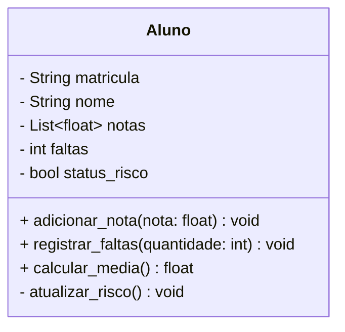
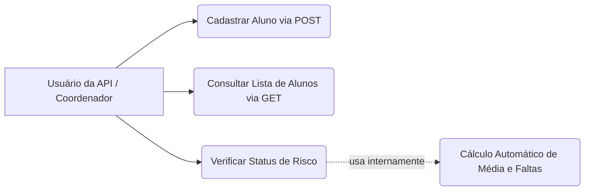

# 🎓 SIMPA - Sistema Inteligente de Monitoramento e Predição Acadêmica

O SIMPA é uma plataforma analítica orientada a dados, desenvolvida como Projeto Integrador do 2º Período de Inteligência Artificial da UniEVANGÉLICA. 

O objetivo do sistema é analisar notas, frequência e indicadores acadêmicos para identificar padrões, estimar riscos de evasão e oferecer recomendações estratégicas para a coordenação.

## 🏗️ Arquitetura do Projeto (Ciclo 1)
O projeto segue a estrutura recomendada de separação de responsabilidades:
* `models/`: Entidades centrais e regras de negócio usando Programação Orientada a Objetos (POO).
* `api/`: Rotas Flask/FastAPI para comunicação web.
* `services/`: Cálculos estatísticos e validações de risco.
* `data/`: Base de dados simulada (CSV/JSON).
* `docs/`: Documentação e Diagramas UML.

## 📊 Dicionário de Dados (`alunos.csv`)
* `matricula`: (Texto) Código de identificação único do aluno. Espera-se 7 dígitos.
* `nome`: (Texto) Nome completo ou primeiro nome do aluno.
* `nota_1`: (Decimal) Nota da primeira avaliação. Valores esperados entre 0.0 e 10.0.
* `nota_2`: (Decimal) Nota da segunda avaliação. Valores esperados entre 0.0 e 10.0.
* `faltas`: (Inteiro) Número total de aulas que o aluno faltou. Valores esperados de 0 para cima.

## 📐 Modelagem Documentada (UML)
Abaixo estão os diagramas estruturais do sistema para o Marco 1, detalhando a arquitetura Orientada a Objetos e os Casos de Uso da API.

### Diagrama de Classes

### Diagrama de Casos de Uso (API)

## 🚀 Tecnologias Utilizadas
* Python 3
* Flask (Criação da API)
* Pandas / Numpy (Para análise de dados futura)

## 👥 Equipe de Desenvolvimento
1. Nicolas Reis
2. Paula Tomazzelli
3. Tales Ferreira
4. Enzo Garcia
5. Joao Pedro Silva Reis
6. João Gabriel Neres Araújo
7. Matheus Felipe