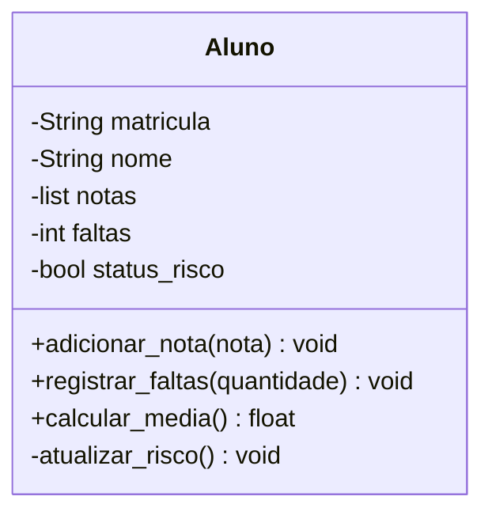
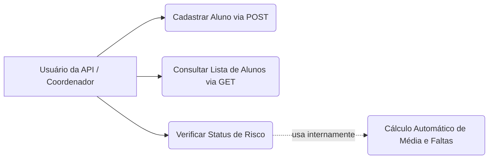

# 🎓 SIMPA - Sistema Inteligente de Monitoramento e Predição Acadêmica

O SIMPA é uma plataforma analítica orientada a dados, desenvolvida como Projeto Integrador do 2º Período de Inteligência Artificial da UniEVANGÉLICA. 

O objetivo do sistema é analisar notas, frequência e indicadores acadêmicos para identificar padrões, estimar riscos de evasão e oferecer recomendações estratégicas para a coordenação utilizando Inteligência Artificial (Google Gemini).

## 🏗️ Arquitetura do Projeto (Ciclo Atualizado)
O projeto evoluiu para uma aplicação Full-Stack, seguindo a estrutura recomendada de separação de responsabilidades:
* `models/`: Entidades centrais e regras de negócio usando Programação Orientada a Objetos (POO).
* `api/` e `app.py`: Rotas Flask para comunicação web e lógica de controle.
* `services/`: Cálculos estatísticos, regressão preditiva e validações de risco.
* `data/`: Base de dados (CSV) e armazenamento de gráficos preditivos.
* `templates/`: Interface web do Dashboard Executivo (HTML).
* `static/`: Recursos visuais e mídias (Logo, CSS).
* `docs/`: Documentação e Diagramas UML.

## 📊 Dicionário de Dados (`alunos.csv`)
* `matricula`: (Texto) Código de identificação único do aluno. Espera-se 7 dígitos.
* `nome`: (Texto) Nome completo ou primeiro nome do aluno.
* `nota_1`: (Decimal) Nota da primeira avaliação. Valores esperados entre 0.0 e 10.0.
* `nota_2`: (Decimal) Nota da segunda avaliação. Valores esperados entre 0.0 e 10.0.
* `faltas`: (Inteiro) Número total de aulas que o aluno faltou. Valores esperados de 0 para cima.

## 📐 Modelagem Documentada (UML)
Abaixo estão os diagramas estruturais do sistema para o Marco 1, detalhando a arquitetura Orientada a Objetos e os Casos de Uso da API.

### Diagrama de Classes

```mermaid
classDiagram
    class Aluno {
        -String matricula
        -String nome
        -list notas
        -int faltas
        -bool status_risco
        +adicionar_nota(nota) void
        +registrar_faltas(quantidade) void
        +calcular_media() float
        -atualizar_risco() void
    }
```

### Diagrama de Casos de Uso (API)

```mermaid
flowchart LR
    A[Usuário da API / Coordenador] --> B(Cadastrar Aluno via POST)
    A --> C(Consultar Lista de Alunos via GET)
    A --> D(Verificar Status de Risco)
    
    D -. "usa internamente" .-> E(Cálculo Automático de Média e Faltas)
```

## 🚀 Tecnologias Utilizadas
* **Backend:** Python 3, Flask
* **Front-end:** HTML5, CSS3, Bootstrap (Dark Mode)
* **Ciência de Dados:** Pandas, NumPy (Estatística), Matplotlib (Gráficos)
* **Inteligência Artificial:** Google Generative AI (Gemini 2.5 Flash) para Planos de Ação.

## ⚙️ Como Executar o Projeto

Siga os passos abaixo para rodar o SIMPA localmente na sua máquina:

1. **Clone o repositório ou extraia o arquivo ZIP.**
2. **Abra o terminal e navegue até a pasta raiz do projeto:**
   ```bash
   cd simpa-unievangelica
   ```
3. **Instale as dependências necessárias:**
   O projeto utiliza bibliotecas externas. Para instalar, rode o comando:
   ```bash
   pip install -r requirements.txt
   ```
4. **Inicie o servidor do sistema:**
   ```bash
   python app.py
   ```
5. **Acesse o Dashboard Executivo no Navegador:**
   Abra o seu navegador (Chrome, Safari, etc.) e acesse:
   👉 `http://localhost:5001/`
   
   A partir do Dashboard, você poderá visualizar as estatísticas globais, indicadores de risco e solicitar o Plano de Ação gerado pela IA.

## 👥 Equipe de Desenvolvimento
1. Nicolas Reis
2. Paula Tomazzelli
3. Tales Ferreira
4. Enzo Garcia
5. Joao Pedro Silva Reis
6. João Gabriel Neres Araújo
7. Matheus Felipe